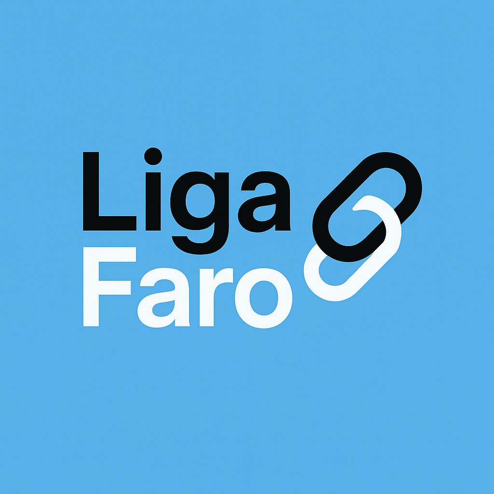

# LigaFaro - Plataforma Comunitária de Faro



## Descrição

O LigaFaro é uma plataforma comunitária digital desenvolvida para conectar os residentes e visitantes da cidade de Faro, no Algarve. Este projeto visa fortalecer os laços comunitários, promover eventos locais e facilitar o acesso a informações relevantes sobre a cidade.

## Funcionalidades

- **Painel Principal**: Visão geral das atividades e destaques da comunidade
- **Notícias Locais**: Atualizações sobre acontecimentos em Faro e região do Algarve
- **Eventos**: Calendário de eventos locais com detalhes e possibilidade de participação
- **Fórum**: Espaço de discussão para tópicos relevantes à comunidade
- **Comunidade**: Perfis de membros e networking local
- **Mercado**: Compra, venda e troca de produtos e serviços entre membros
- **Voluntariado**: Oportunidades para contribuir com a comunidade
- **Chatbot**: Assistente virtual para responder perguntas sobre Faro

## Tecnologias Utilizadas

- **Frontend**: React, TypeScript, Tailwind CSS, Shadcn UI
- **Backend**: Node.js, Express
- **APIs**: Integração com APIs de notícias e clima
- **Processamento de Dados**: Python para scraping e processamento de notícias

## Requisitos

- Node.js (v18 ou superior)
- Python 3.8 ou superior
- NPM ou Yarn

## Instalação

1. Clone o repositório:
   ```bash
   git clone https://github.com/Outubro2019/ligafaro.git
   cd ligafaro
   ```

2. Instale as dependências:
   ```bash
   npm install
   ```

3. Configure as variáveis de ambiente:
   - Crie um ficheiro `.env` na raiz do projeto com as seguintes variáveis:
     ```
     OPENAI_API_KEY=sua_chave_da_api_aqui
     WEATHER_API_KEY=sua_chave_da_api_aqui
     NEWS_API_KEY=sua_chave_da_api_aqui
     ```

4. Instale as dependências Python:
   ```bash
   pip install -r requirements.txt
   ```

## Execução

1. Inicie o servidor de API:
   ```bash
   node server.js
   ```

2. Em outro terminal, inicie o servidor de desenvolvimento:
   ```bash
   npm run dev
   ```

3. Aceda à aplicação em [http://localhost:3001](http://localhost:3001)

## Estrutura do Projeto

- `/public` - Recursos estáticos
- `/src` - Código fonte da aplicação
  - `/components` - Componentes React reutilizáveis
  - `/contexts` - Contextos React para gestão de estado
  - `/data` - Dados estáticos e mocks
  - `/hooks` - Hooks personalizados
  - `/lib` - Bibliotecas e utilitários
  - `/pages` - Componentes de página
  - `/services` - Serviços e integrações com APIs
  - `/types` - Definições de tipos TypeScript
  - `/utils` - Funções utilitárias

## Contribuições

Contribuições são bem-vindas! Para contribuir:

1. Faça um fork do projeto
2. Crie uma branch para a sua funcionalidade (`git checkout -b feature/nova-funcionalidade`)
3. Faça commit das suas alterações (`git commit -m 'Adiciona nova funcionalidade'`)
4. Faça push para a branch (`git push origin feature/nova-funcionalidade`)
5. Abra um Pull Request

## Licença

Este projeto está licenciado sob a licença MIT - consulte o ficheiro LICENSE para mais detalhes.

## Contacto

Para questões ou sugestões, por favor contacte-nos através do email: [contacto@ligafaro.pt](mailto:contacto@ligafaro.pt)

---

Desenvolvido com ❤️ para a comunidade de Faro - 2025
